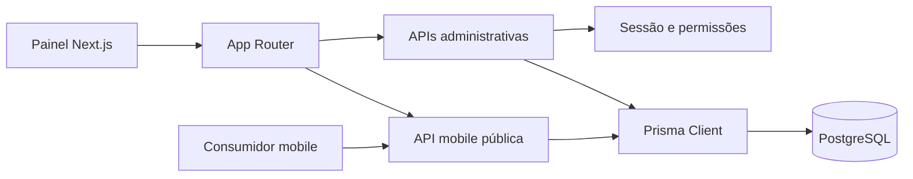
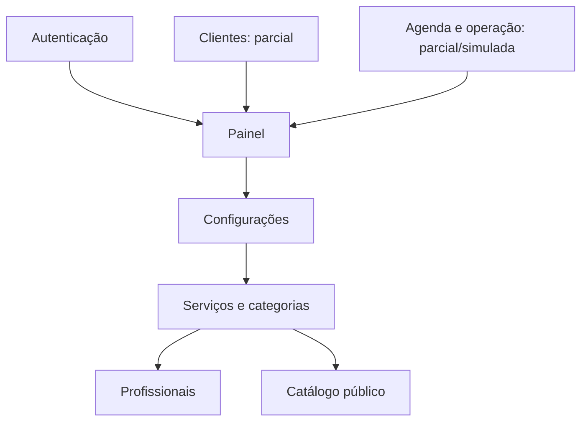

# Arquitetura

O App Router está em `src/app`; regras compartilhadas em `src/lib`; interfaces em `src/features`; persistência em `prisma/schema.prisma`. O middleware apenas exige cookie nas rotas `/dashboard`; cada API faz a autorização definitiva.

Fontes: `src/middleware.ts`, `src/app`, `src/lib/auth`, `src/lib/services`.
