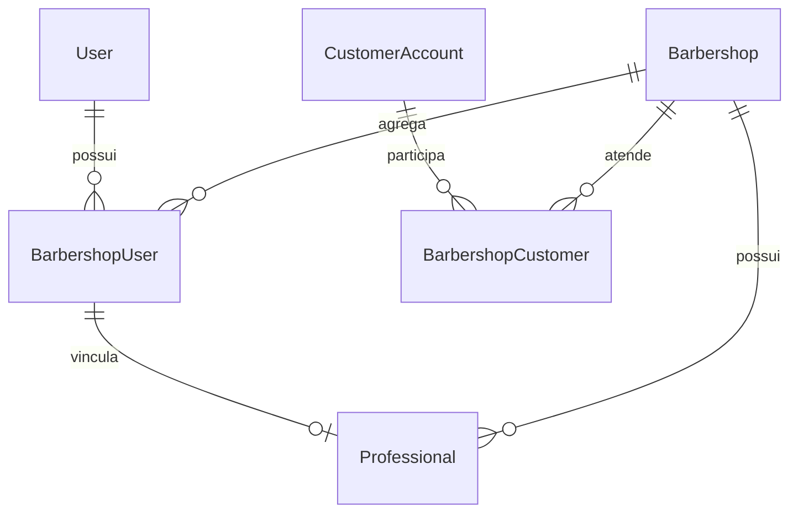

# Identidades

- `User`: credencial administrativa.
- `BarbershopUser`: membership e `tenantRole`.
- `Professional`: perfil operacional; pode ser independente ou vinculado a uma membership.
- `CustomerAccount`: identidade de cliente separada, ainda parcial no produto.

`Professional.role` é texto de exibição; `permissionLevel` é acesso operacional (`BARBER`/`ASSISTANT`); `tenantRole` vem da membership; `globalRole` só representa `SUPER_ADMIN` na sessão.

O owner vinculado autentica uma única vez como `USER`; seu `Professional.email` e credenciais permanecem nulos. Fontes: `prisma/schema.prisma`, `src/app/api/login/route.ts` e `src/lib/professionals/admin-presentation.ts`.
