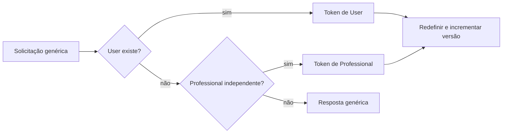

# Recuperação de acesso

`/api/forgot-password` evita revelar existência da conta. `/api/reset-password` limpa o token e incrementa a versão. `/api/first-access` aceita apenas Professional independente, `PENDING`, com convite válido. Perfil vinculado não recebe segunda credencial.

Envio por Resend é condicional às variáveis de ambiente. Fontes: rotas homônimas em `src/app/api`.
