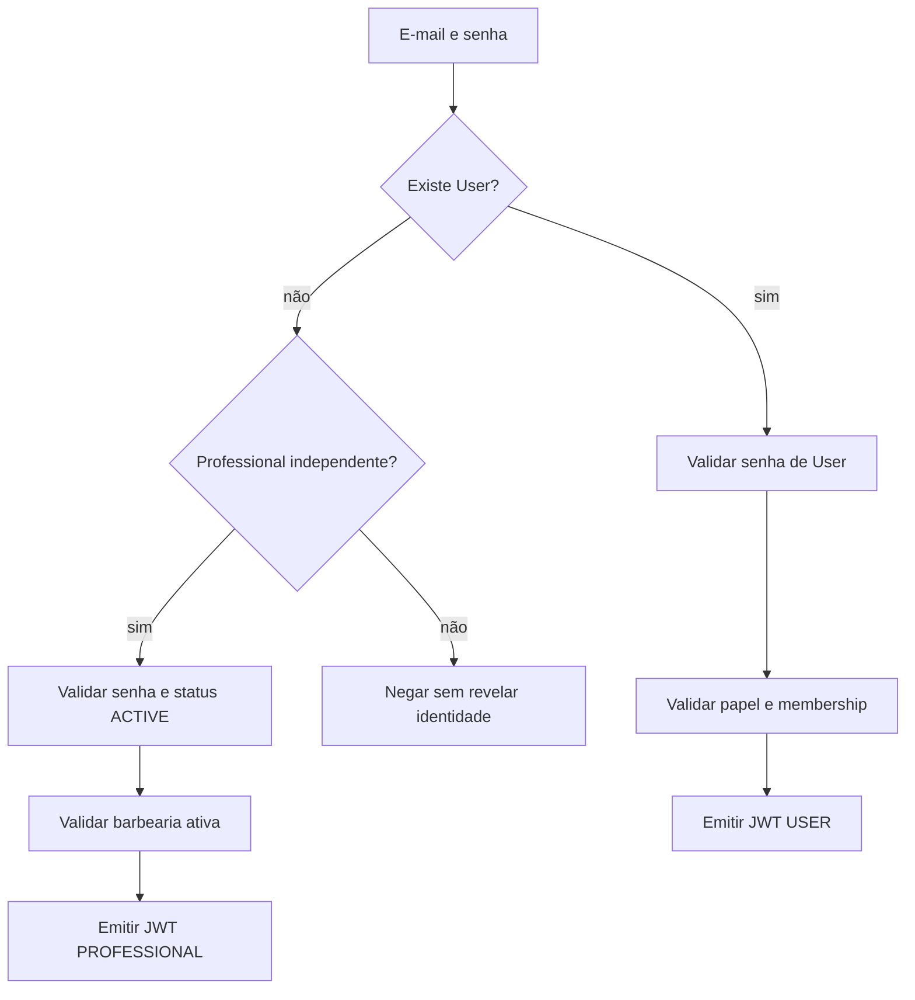
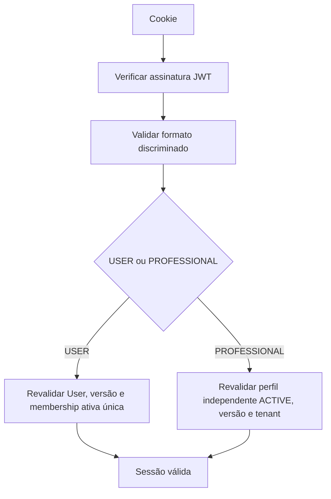

# Sessões JWT

O token contém a identidade mínima e `sessionVersion`. `getSession()` reconsulta o banco em toda validação. Mudança de nível, senha ou inativação incrementa a versão quando aplicável, invalidando tokens anteriores.

Cookies são `httpOnly`, caminho `/` e expiração JWT de sete dias. O código atual não configura explicitamente `secure` ou `sameSite`; isso deve ser avaliado antes de produção.

Fontes: `src/lib/auth/claims.ts`, `src/lib/auth/session.ts`, `src/app/api/login/route.ts`.
