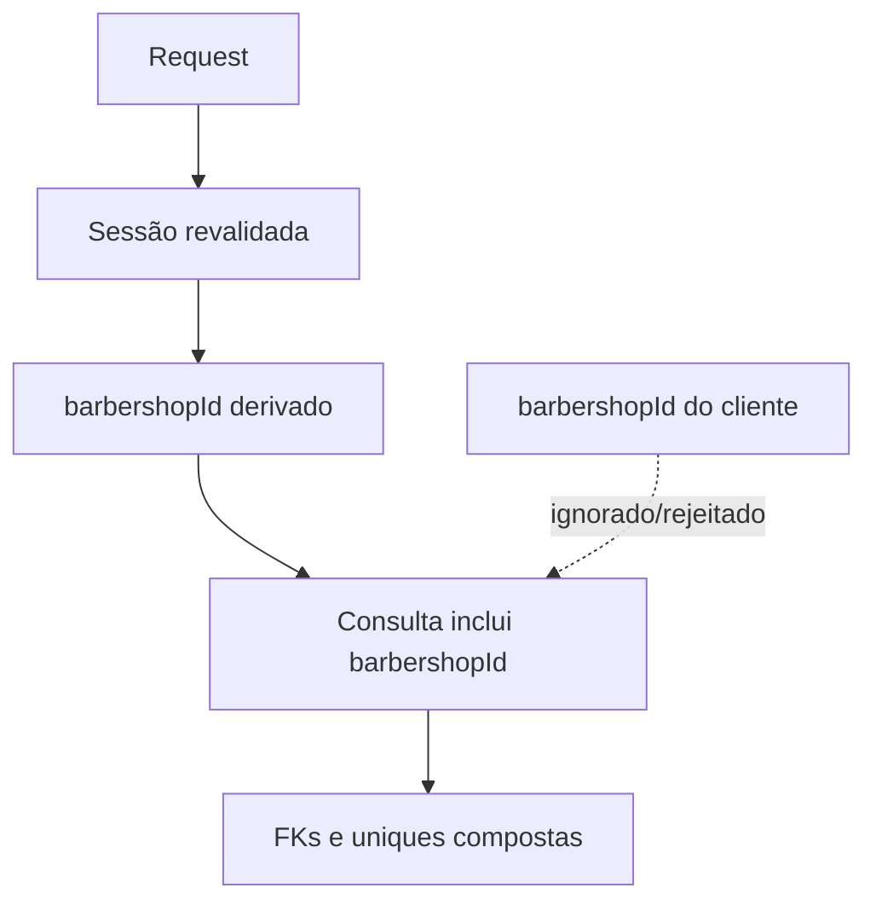

# Isolamento por tenant

O tenant vem da sessão/membership, nunca do payload. Recursos por ID são consultados com `barbershopId`; divergência resulta em 404. FKs compostas protegem `ProfessionalService`, categorias e o vínculo de owner.

Fontes: `src/lib/services/catalog.ts`, rotas administrativas e `prisma/schema.prisma`.
