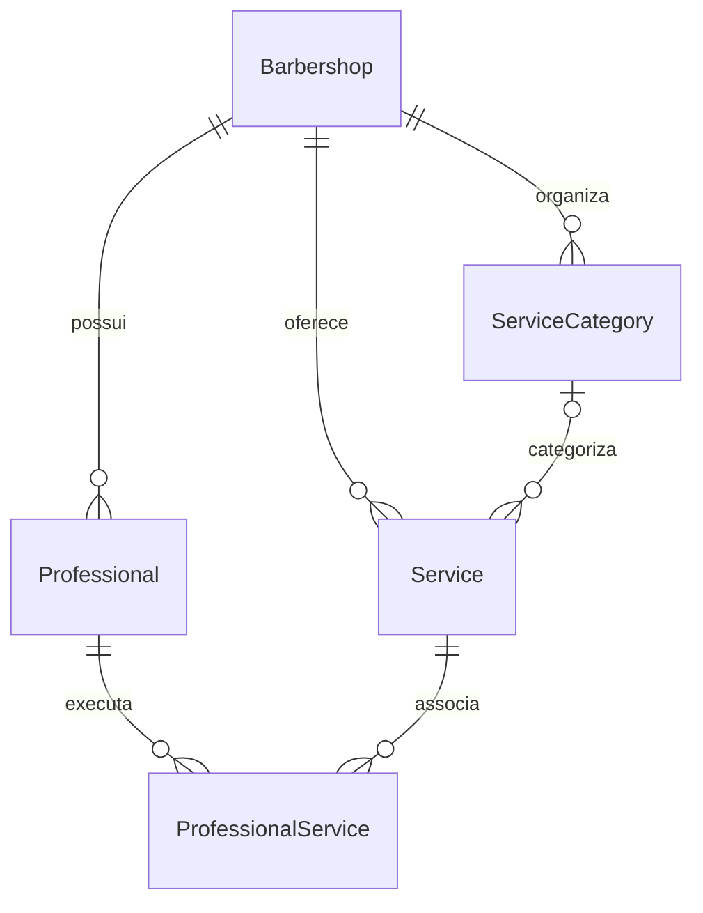

# Modelo de dados

Entidades principais: `User`, `BarbershopUser`, `Professional`, `Barbershop`, `CustomerAccount`, `BarbershopCustomer`, `Service`, `ServiceCategory` e `ProfessionalService`.

`ProfessionalService` usa chave composta `(barbershopId, professionalId, serviceId)`. As FKs compostas garantem que serviço e profissional pertençam ao tenant informado. Valores monetários são centavos inteiros.

Fonte canônica: `prisma/schema.prisma`.
