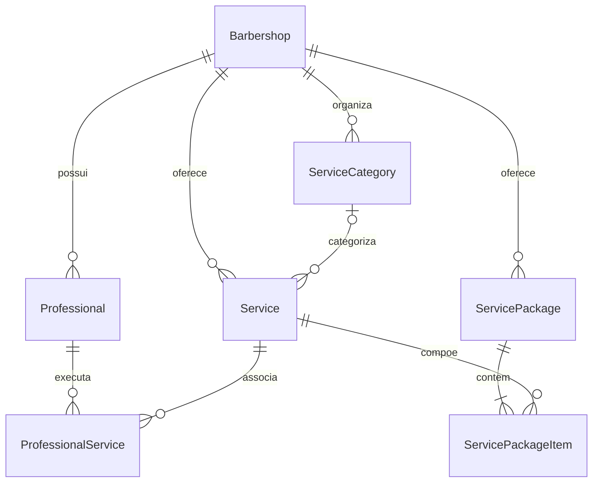

# Modelo de dados

Entidades principais incluem `ServicePackage` e `ServicePackageItem`. O item usa a chave `(barbershopId, packageId, serviceId)` e FKs compostas para impedir associações entre tenants. Preço original e duração não são persistidos: são derivados dos serviços.

`ProfessionalService` usa chave composta `(barbershopId, professionalId, serviceId)`. As FKs compostas garantem que serviço e profissional pertençam ao tenant informado. Valores monetários são centavos inteiros.

Fonte canônica: `prisma/schema.prisma`.
