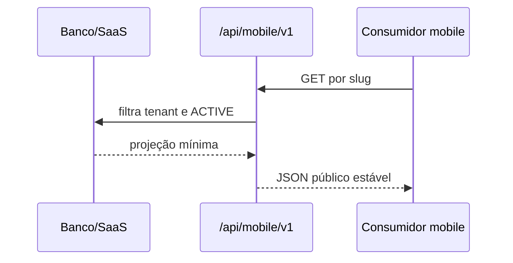

# Catálogo mobile

**Estado: IMPLEMENTADO como API pública de leitura.** O aplicativo Expo não está neste repositório.

Retorna identidade pública da barbearia, serviços ativos e profissionais ativos associados. Não expõe e-mail, comissão, credenciais, membership, `accessEmail` ou notas internas.

Fontes: `src/app/api/mobile/v1`, `src/lib/mobile/public-catalog.ts`, `tests/routes/mobile-catalog.test.ts`.
