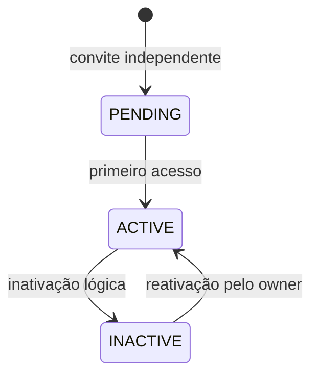

# Profissionais

**Estado: IMPLEMENTADO.** CRUD administrativo tenant-safe, primeiro acesso para independentes, perfil vinculado e apresentação administrativa sem campos internos.

Independentes usam `Professional.email/password`; vinculados usam a credencial `User`. O owner vinculado mantém `permissionLevel=BARBER`, não pode ser inativado pela tela comum e recebe `accessEmail` derivado apenas na resposta administrativa.

Inativação incrementa `sessionVersion` uma vez, preserva cadastro e `ProfessionalService`; reativação não restaura sessões antigas. Novas associações aceitam somente profissionais ativos.

Fontes: `src/app/api/professionals`, `src/lib/professionals`, `src/features/professionals`.
