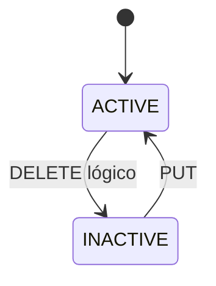

# Serviços

**Estado: IMPLEMENTADO para serviços individuais e combos/pacotes.**

O owner gerencia nome, descrição, preço em centavos, duração, ordem, status, categoria opcional e profissionais ativos associados. Unicidade de nome e validações numéricas existem no banco e na aplicação.

`/dashboard/servicos` redireciona para `/dashboard/configuracoes/servicos`. Associações são substituídas em transação e permanecem ao inativar um profissional.

Fontes: `src/app/api/services`, `src/features/services`, `src/lib/services/catalog.ts`.

## Combos / Pacotes

O owner combina ao menos dois serviços ativos, define nome, descrição, preço promocional, ordem e status. O preço original, a duração total e a economia são derivados. Criação e substituição de itens são transacionais; inativação é lógica, idempotente e preserva itens. A interface oferece busca, estados vazio/sem resultado, edição e switch acessível.
