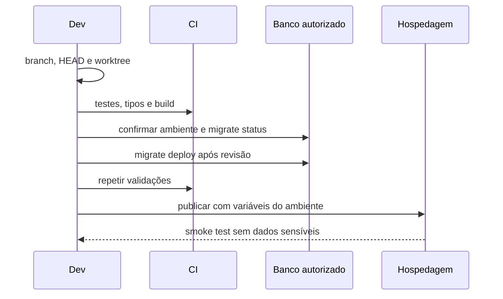

# Checklist de deploy

- [ ] Branch/HEAD e revisão aprovados.
- [ ] Documentação e changelog atualizados.
- [ ] SQL sem operação inesperada e ambiente confirmado.
- [ ] Testes, TypeScript, build e `diff --check` aprovados.
- [ ] Variáveis configuradas sem exposição.
- [ ] Contrato mobile comparado com consumidores.
- [ ] Plano de rollback definido; nenhum `reset`, seed ou `db push`.
