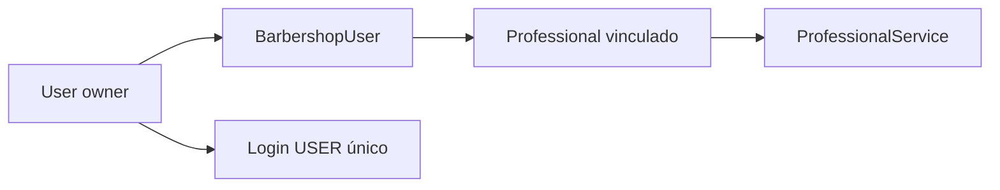
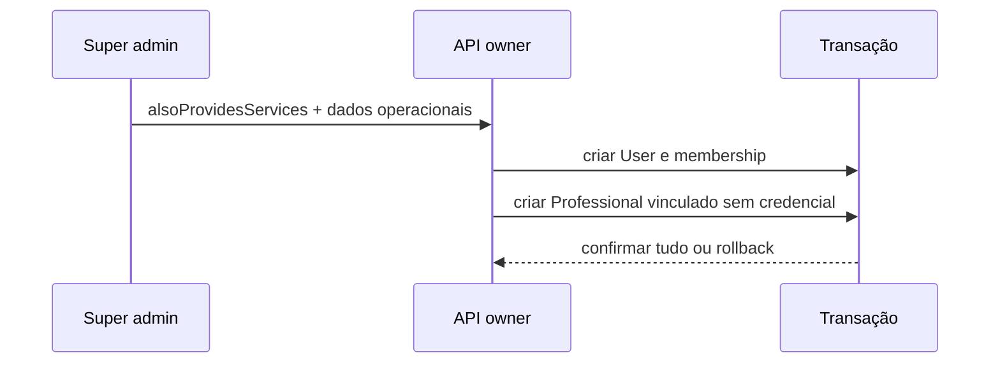

# ADR-002 — Owner com perfil Professional

- **Status:** aceito
- **Data:** 2026-08-14

## Contexto e problema

O proprietário pode atender clientes, mas duplicar login e senha criaria ambiguidade.

## Decisão

Vincular `Professional(barbershopId,userId)` à membership composta e manter autenticação exclusivamente como `User`.

Para criação futura:

## Alternativas

Segundo Professional independente e busca por e-mail foram rejeitados.

## Consequências e riscos

Positivo: uma credencial e tenant garantido pela FK. Risco: APIs devem distinguir perfil vinculado; testes cobrem e-mail, permissão e inativação.

Referências: migration `link_owner_professional_profile`, rotas de owner/profissionais.
